#############################
Ubuntu Installation Guide
#############################

Requirements
*******************

- Mono server/ mono-xsp4 package (for running ASP.Net applications) -- Tested with mono 6.12.0.90 and xsp4 "Mono.WebServer2.dll 0.4.0.0"
- XAMPP server for MySQL
- Elasticsearch (for Hive server) – version 2.4.3 (recommended)
- Hive Server – version 1.0.2 (latest)

Installing Mono Server
*************************

1. | Follow the steps provided |download_mono| to install the prerequisites for Mono server (for Ubuntu).
   | The setup is tested for mono-devel mono-complete, so make sure to have installed both.
2. Install mono-xsp4 for running ASP.Net applications.

.. code-block:: bash

   sudo apt-get install mono-xsp4

3. Verify mono server by running the following command. If if installed correctly, it should not throw any error.

.. code-block:: bash

   mono --version

.. |download_mono| raw:: html

  <a href="https://www.mono-project.com/download/stable/" target="_blank">here</a>

Installing XAMPP Server
****************************

We need XAMPP Server to create the database for the Dashboard. We can also go for other alternatives such as Apache, Nginx or MySQL Workbench etc.
XAMPP installation steps are given below:

1. Before you start to install XAMPP on Ubuntu. You must be logged in with a non-root user account on your server/desktop with sudo privileges.
2. Install *netstat* by running the following command (Netstat is required by XAMPP):

.. code-block:: bash

   sudo apt install net-tools

3. Install XAMPP using the following command:

.. code-block:: bash

   sudo wget https://downloadsapachefriends.global.ssl.fastly.net/7.3.0/xampp-linux-x64-7.3.0-0-installer.run?from_af=true

4. Make the downloaded file executable with:

.. code-block:: bash

   sudo chmod +x xampp-linux-x64-7.3.0-0-installer.run

5. Run the file by executing the command:

.. code-block:: bash

   sudo ./xampp-linux-x64-7.3.0-0-installer.run

6. You will see the following screen. Click next.

.. _Figure 1:
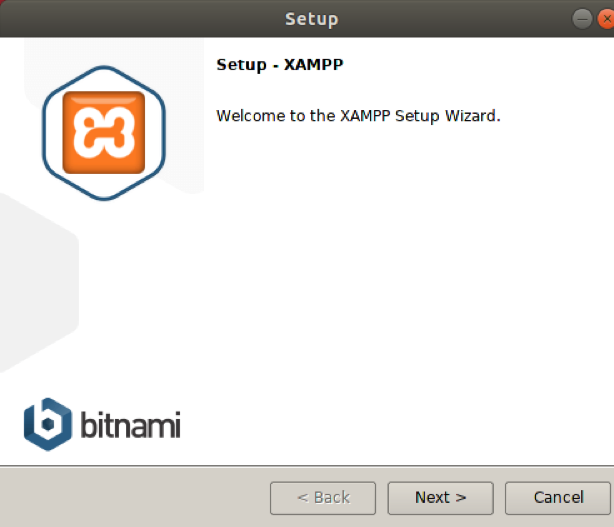

7. Select required components. It is recommended to keep the default selection.

.. _Figure 2:
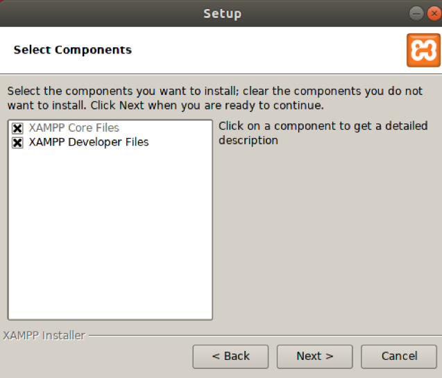

8. The XAMPP control panel will launch after complete installation.

.. _Figure 3:
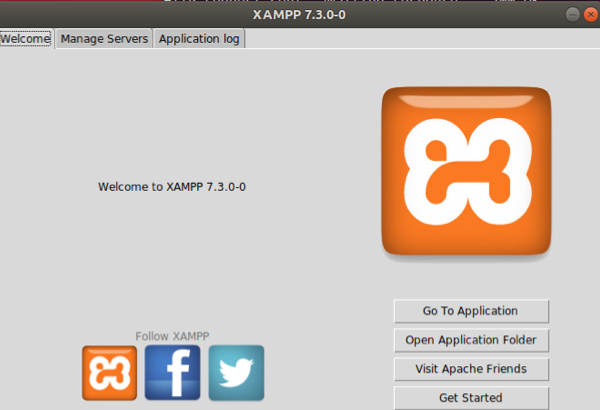

9. Go to tab Manage Servers on the XAMPP control panel. You will see the Apache server running. Make sure to start MySQL Database server manually.

.. _Figure 4:
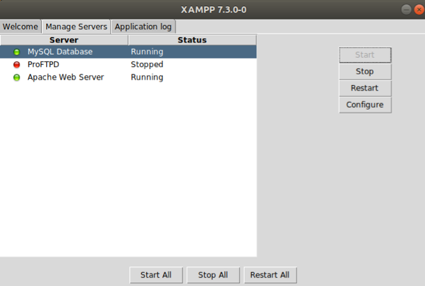

10. Visit the link http://localhost/ to see the XAMPP dashboard.

.. _Figure 5:
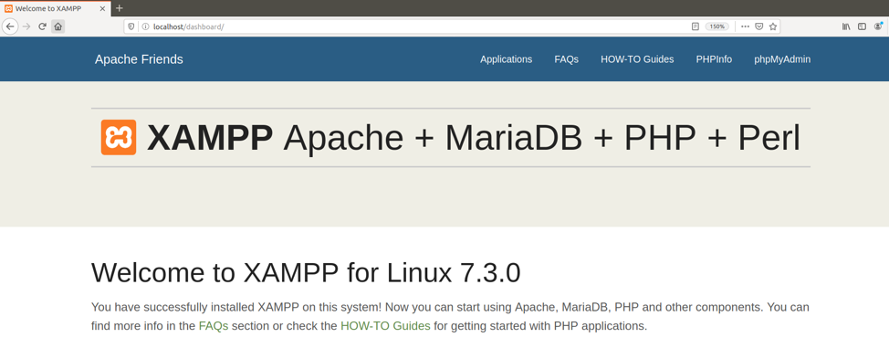

Creating the Database
***************************

1. Visit http://localhost/phpmyadmin to open admin module for MySQL in XAMPP.
2. Create a database and update the name of database and its credentials in Dashboard/XMLParser/XMLParser/web.config and Dashboard/XMLParser/socialexperiment.sql files.

.. _Figure 6:
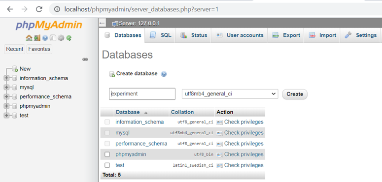

3. Import and execute Dashboard/XMLParser/socialexperiment.sql using phpMyAdmin to create all necessary tables in the Dashboard database.

.. _Figure 7:
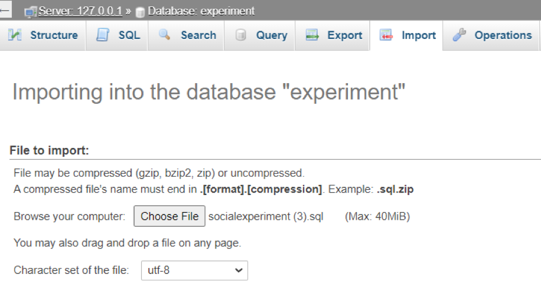

4. You will see the following screen after successful execution of the script:

.. _Figure 8:
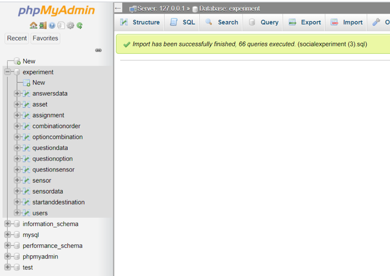

Resettign the Database
***************************

If ever there is the need to reset the database, one can open the following link:

.. code-block:: text

   http://127.0.0.1:8080/admin/setup/YES_I_AM_SURE

Cloning Source Code
*********************

- Place the *Go_Workspace* at your home directory "~/". It contains the source code for Elasticsearch and bash scripts to run Elasticsearch & Hive server locally.
- Clone the source code of Dashboard by executing the command:

.. code-block:: bash

   git clone https://github.com/epournaras/SmartAgoraBackend

Running Mono & Hive servers
******************************

Run the hive server by changing the working directory to "~/Go_Workspace/bin" and execute the following command in terminal:

.. code-block:: bash

   ./hive-server -index hive -esDomain localhost -esPort=9200 -port 8080 &

.. _Figure 9:
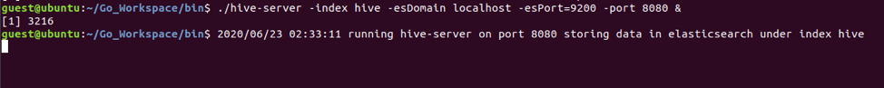

Visit http://localhost:8080 to check the status of the server. 

.. _Figure 10:
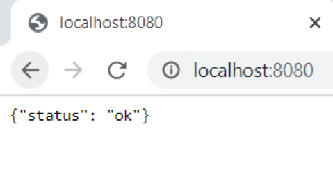

To stop the hive server, execute the following command:

.. code-block:: bash

   pkill hive-server

Note: The former command should be run from the "~/Go_Workspace/bin" directory.

.. _Figure 11:
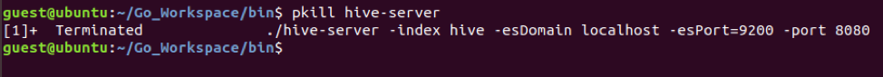

Run the web server (mono server) by navigating to "~/Dashboard/XMLParser/XMLParser" and execute the following command:

.. code-block:: bash

   xsp4 --port 9000 --nonstop &

Building the Solution File
****************************

1. Open the file Dashboard/XMLParser/XMLParser/Web.config and add the credentials for the MySQL database and host and port addresses for the Hive server. 
2. Build the solution file by navigating to /Dashboard/XMLParser/ and execute the following command in the terminal:

.. code-block:: bash

   sudo msbuild XMLParser.sln

After a successful build, you will see the message "*Build Succeeded.*".
